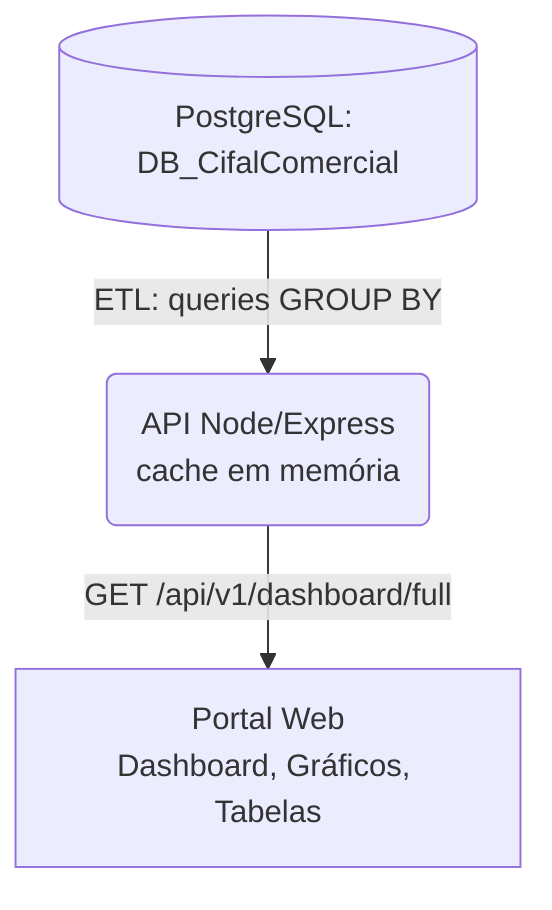

# Pipeline de Dados

Este documento descreve o fluxo de dados atual do Portal Comercial. **Todos os dados vêm da API**, que agrega direto do banco PostgreSQL. Não há mais planilhas Excel nem arquivos estáticos no caminho.

## Fluxo Atual (Pipeline)

- A **API** (`api/`) roda um ETL que materializa o cubo de vendas do período numa TEMP TABLE e faz as agregações (`GROUP BY`) diretamente no PostgreSQL, montando o JSON completo que o front-end consome. O resultado fica em cache e é reciclado periodicamente.
- O **Portal web** (`public/`) apenas faz `fetch` de `GET /api/v1/dashboard/full` no boot e renderiza. Nenhum dado é lido de arquivo estático nem de planilha.
- **Meta** e **Estoque** também vêm do banco: metas de `cifalcomercial.metacategoria` / `metasanualporvendedor`; estoque "box vendedor" de `cifalcomercial.posicao_estoque_diario_vendedor`.
- A **hierarquia real** (gerente → supervisor → vendedor) vem de `cifalcomercial.supervisor` + `cifalcomercial.eqvend` (só ativos).

## Fontes no Banco (por indicador)

### Métricas (somadas/agregadas)
- **Receita / Faturamento** → `receita` / `r`
- **Custo** → `custo` / `c` e cálculo de `margem_geral` / `m`
- **Quantidade** → `qtde` / `q`
- **Peso** → `peso` / `p`

### Dimensões e Tempo (agrupadores)
- **Data de Faturamento** (`Pedidos.DataFechamento`) → agregações `por_mes`, `por_dia`.
- **Gerente / Supervisor / Vendedor** (`gerente`, `supervisor`, `eqvend`) → `por_gerente`, `por_supervisor`, `full_vendedores` e cubos `hier_*`.

### Classificação de Produto (JOINs)
- **Categoria** (`categoriasproduto.descategoriaprod`) → `por_categoria`, `por_dia_categoria`.
- **Grupo** (`SubGrupos.DesSubGrupo`) → `por_grupo`.

### Identificação (contagens distintas)
- **Pedido** → `n_pedidos`, `ticket_pedido`.
- **Cliente** → `n_cli`, `n_clientes` por categoria.
- **Vendedor** → `n_vend`.
- **Produto** → `n_prod`.

## Endpoints da API
- `GET /api/v1/dashboard/full` → payload completo consumido pelo Portal (todos os períodos + `_estoque` + `_hierarquia`).
- `GET /api/v1/dashboard/resumo|vendas-por-dia|categorias|hierarquia?periodo=2026_1` → agregações específicas (uso pontual).
